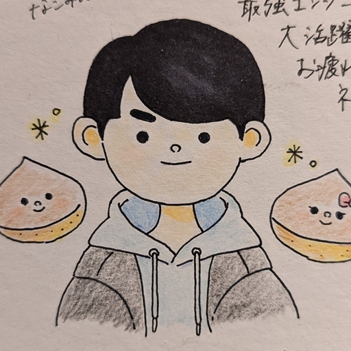
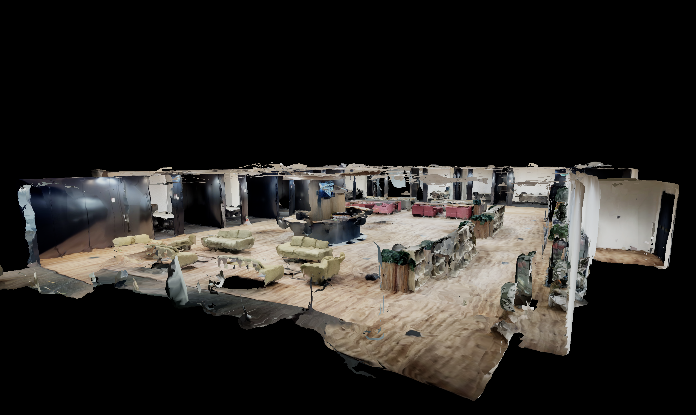
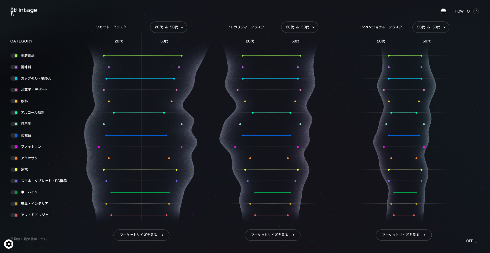
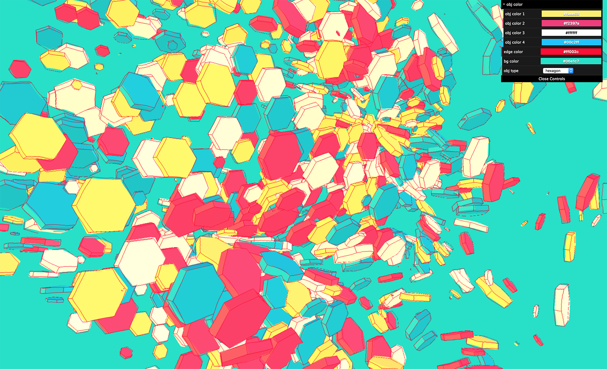
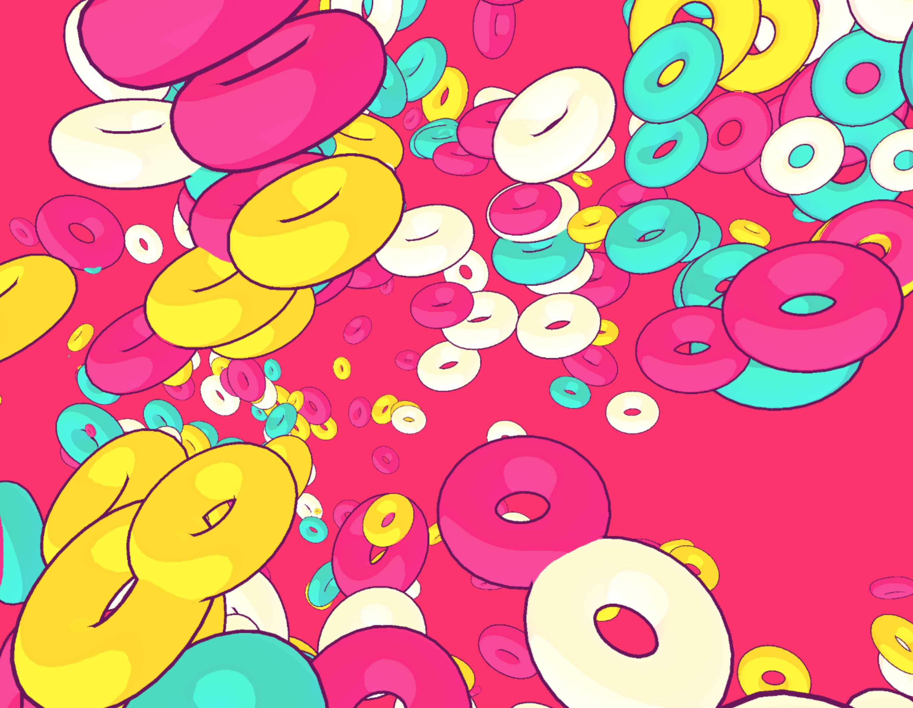
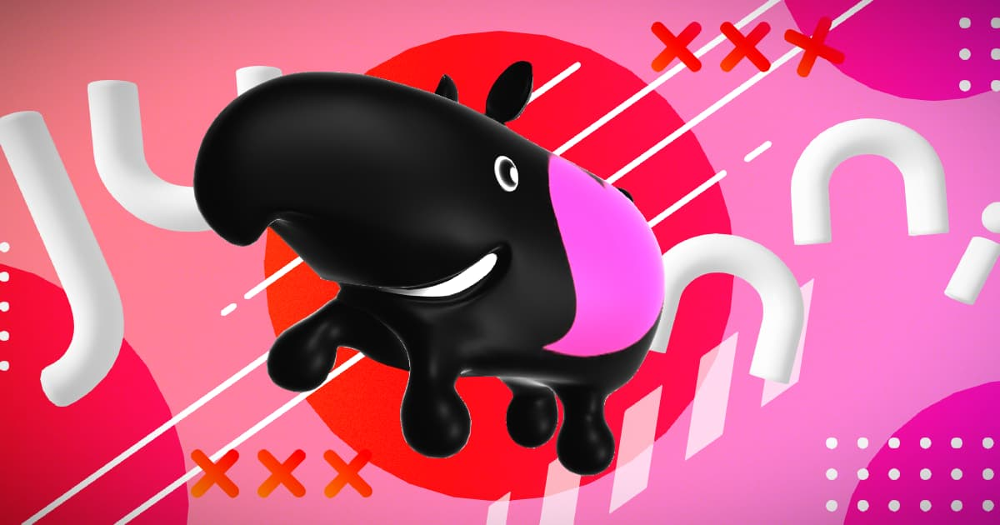
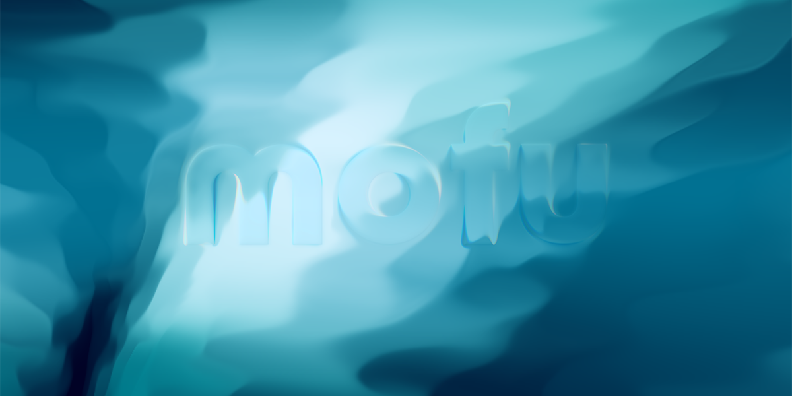
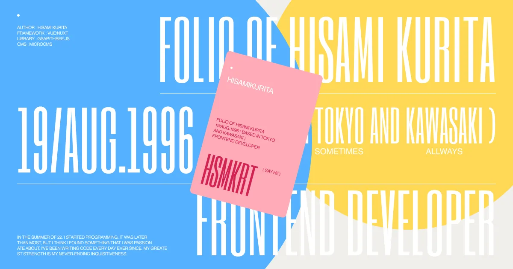
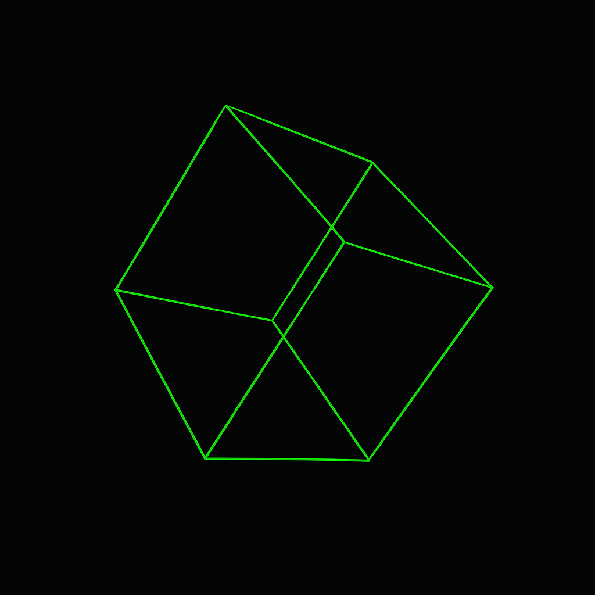
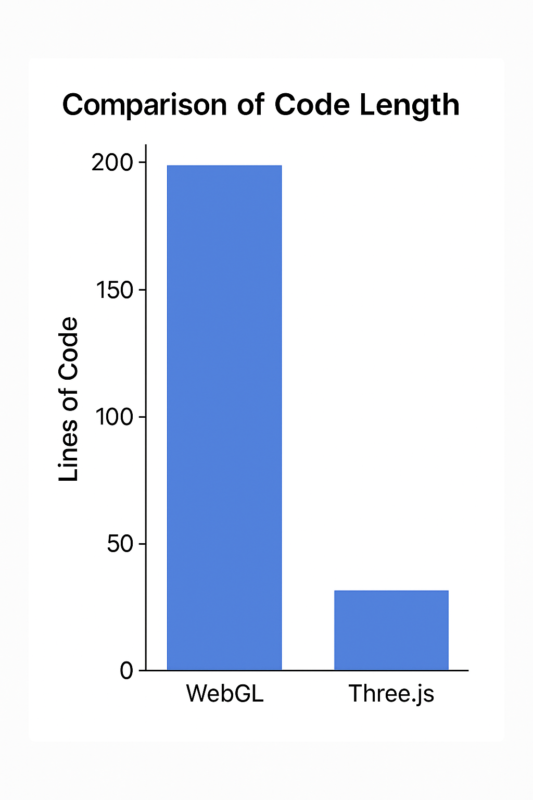

# フロントエンドの世界を広げる「WebGL」という技術について...

---

# 自己紹介


栗田久海
フロントエンドエンジニア
WEBサイト制作を5年、システム開発は一年ぐらい経験している
趣味でグラフィックプログラミングをよく書く

---

# 「WebGL」って技術がすごい。何でもできる。

---

# 「WebGL」ってなんだろう🧐

WebGLとは、Webブラウザ上で3Dや2DのグラフィックスをGPUによって高速で描画するための技術。JavaScript APIを利用して、HTMLのcanvas要素に描画する。

WebGLを使えば主に次のようなコンテンツ開発ができる。

- 3Dモデルの表示
- ゲームコンテンツ
- データビジュアライゼーション
- プログラミングアート
- 魅力的で華やかな画面演出（広告系のWEBサイトなど）

---

# 実際「WebGL」ってどういう風に使われているの？

---

# 3Dモデルの表示

[アルサーガオフィスを3Dスキャンしてみる](https://www.arsaga.jp/wp-content/newyear-dev-2025/)



---

# ゲームコンテンツ

[雀魂](https://mahjongsoul.com/)


---

# データビジュアライゼーション

[VISUALIZING LIQUID CONSUMPTION DATA | INTAGE Inc.](https://www.intage.co.jp/lp/vlcd2023/)



---

# プログラミングアート

[Rough Drawing Effect](https://mnmxmx.github.io/rough-drawing-effect/dst/)



---

# プログラミングアート

[Toon Shading](https://mnmxmx.github.io/toon-shading/dst/index.html)



---

# 華やかな画面演出（広告系のWEBサイトなど）

[Junni is...](https://next.junni.co.jp/)



---

# 華やかな画面演出（広告系のWEBサイトなど）

[mofu](https://mofu-dev.com/en/)



---

# 華やかな画面演出（広告系のWEBサイトなど）

[Hisami Kurita Portfolio](https://hsmkrt1996.com/)



---

# 「WebGL」は頂点の集合体

---

# 「WebGL」は難しい...Three.jsを使おう。

---

# 例えば「立方体を表示して回転させる」コードを書いた場合...



---

```html
<!DOCTYPE html>
<html>
  <head>
    <meta charset="utf-8">
    <title>Three.js Cube</title>
    <style>body { margin: 0; }</style>
  </head>
  <body>
    <script src="https://cdn.jsdelivr.net/npm/three@0.155.0/build/three.min.js"></script>
    <script>
      const scene = new THREE.Scene();
      const camera = new THREE.PerspectiveCamera(75, window.innerWidth / window.innerHeight, 0.1, 1000);

      const renderer = new THREE.WebGLRenderer();
      renderer.setSize(window.innerWidth, window.innerHeight);
      document.body.appendChild(renderer.domElement);

      const geometry = new THREE.BoxGeometry();
      const material = new THREE.MeshBasicMaterial({ color: 0x00ff00, wireframe: true });
      const cube = new THREE.Mesh(geometry, material);
      scene.add(cube);

      camera.position.z = 5;

      function animate() {
        requestAnimationFrame(animate);
        cube.rotation.x += 0.01;
        cube.rotation.y += 0.01;
        renderer.render(scene, camera);
      }

      animate();
    </script>
  </body>
</html>
```

---

```html
<!DOCTYPE html>
<html>
  <head>
    <meta charset="utf-8">
    <title>WebGL Cube</title>
    <style>canvas { width: 100%; height: 100% }</style>
  </head>
  <body>
    <canvas id="glcanvas"></canvas>
    <script>
      const canvas = document.getElementById('glcanvas');
      const gl = canvas.getContext('webgl');

      canvas.width = window.innerWidth;
      canvas.height = window.innerHeight;

      const vertexShaderSource = `
        attribute vec4 a_position;
        attribute vec4 a_color;
        uniform mat4 u_matrix;
        varying vec4 v_color;
        void main() {
          gl_Position = u_matrix * a_position;
          v_color = a_color;
        }
      `;

      const fragmentShaderSource = `
        precision mediump float;
        varying vec4 v_color;
        void main() {
          gl_FragColor = v_color;
        }
      `;

      function createShader(gl, type, source) {
        const shader = gl.createShader(type);
        gl.shaderSource(shader, source);
        gl.compileShader(shader);
        return shader;
      }

      function createProgram(gl, vs, fs) {
        const program = gl.createProgram();
        gl.attachShader(program, vs);
        gl.attachShader(program, fs);
        gl.linkProgram(program);
        return program;
      }

      const vs = createShader(gl, gl.VERTEX_SHADER, vertexShaderSource);
      const fs = createShader(gl, gl.FRAGMENT_SHADER, fragmentShaderSource);
      const program = createProgram(gl, vs, fs);

      const positionLocation = gl.getAttribLocation(program, 'a_position');
      const colorLocation = gl.getAttribLocation(program, 'a_color');
      const matrixLocation = gl.getUniformLocation(program, 'u_matrix');

      const positions = new Float32Array([
        // front face
        -1, -1,  1,  1, -1,  1,  1,  1,  1,
        -1, -1,  1,  1,  1,  1, -1,  1,  1,
        // ...他の5面の頂点座標もここに追加...
      ]);

      const colors = new Float32Array([
        1, 0, 0, 1,  0, 1, 0, 1,  0, 0, 1, 1,
        1, 0, 0, 1,  0, 0, 1, 1,  1, 1, 0, 1,
        // 他の面の色も同様に続く...
      ]);

      const positionBuffer = gl.createBuffer();
      gl.bindBuffer(gl.ARRAY_BUFFER, positionBuffer);
      gl.bufferData(gl.ARRAY_BUFFER, positions, gl.STATIC_DRAW);

      const colorBuffer = gl.createBuffer();
      gl.bindBuffer(gl.ARRAY_BUFFER, colorBuffer);
      gl.bufferData(gl.ARRAY_BUFFER, colors, gl.STATIC_DRAW);

      function drawScene(time) {
        time *= 0.001;
        gl.viewport(0, 0, gl.canvas.width, gl.canvas.height);
        gl.clear(gl.COLOR_BUFFER_BIT | gl.DEPTH_BUFFER_BIT);
        gl.enable(gl.DEPTH_TEST);
        gl.useProgram(program);

        gl.enableVertexAttribArray(positionLocation);
        gl.bindBuffer(gl.ARRAY_BUFFER, positionBuffer);
        gl.vertexAttribPointer(positionLocation, 3, gl.FLOAT, false, 0, 0);

        gl.enableVertexAttribArray(colorLocation);
        gl.bindBuffer(gl.ARRAY_BUFFER, colorBuffer);
        gl.vertexAttribPointer(colorLocation, 4, gl.FLOAT, false, 0, 0);

        const aspect = canvas.clientWidth / canvas.clientHeight;
        const projectionMatrix = mat4.create();
        mat4.perspective(projectionMatrix, Math.PI / 4, aspect, 0.1, 100);
        const viewMatrix = mat4.create();
        mat4.translate(viewMatrix, viewMatrix, [0, 0, -6]);
        const modelMatrix = mat4.create();
        mat4.rotate(modelMatrix, modelMatrix, time, [0, 1, 0]);
        const mvMatrix = mat4.create();
        mat4.multiply(mvMatrix, viewMatrix, modelMatrix);
        const mvpMatrix = mat4.create();
        mat4.multiply(mvpMatrix, projectionMatrix, mvMatrix);

        gl.uniformMatrix4fv(matrixLocation, false, mvpMatrix);
        gl.drawArrays(gl.TRIANGLES, 0, 6 * 6); // 6 faces * 2 triangles * 3 vertices

        requestAnimationFrame(drawScene);
      }

      // ライブラリ使用: gl-matrix
      const mat4 = window.glMatrix.mat4;
      drawScene();
    </script>
    <script src="https://cdn.jsdelivr.net/npm/gl-matrix@3.4.3/gl-matrix-min.js"></script>
  </body>
</html>

```

---

# ざっくり5倍くらい書かないといけない...多分9.5割の実装者はThree.jsを使う。



---

# Canvas API もおすすめ。

---

# CSS でも色々できる。

---

# インスピレーションを刺激する

- [codepen](https://codepen.io/)
- [dribbble](https://dribbble.com/)
- [Coding Math](https://www.youtube.com/@codingmath)
- 日常から

---

# まとめ
